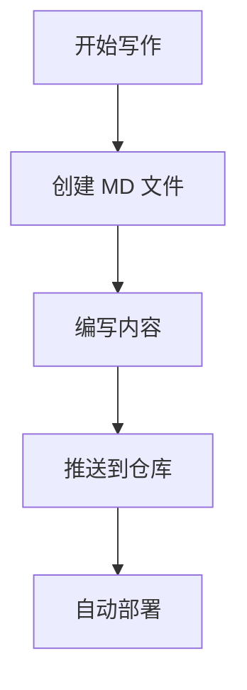

!!! tip 写在前面

这是一篇关于如何使用本博客系统的完整指南，涵盖文章发布、碎碎念更新、书籍管理等核心功能。无论你是第一次使用还是想深入了解更多特性，这篇文章都能帮到你。

!!!

## 📝 文章发布指南

### 文件命名规范

博客文章使用简洁的命名格式，存放在 `content/mds/` 目录下：

```
slug.md
```

**示例：**
- `usage.md` - 使用指南，URL 为 `/usage`
- `markdown-example.md` - Markdown 示例
- `nextjs-tips.md` - Next.js 技巧
- `deployment.md` - 部署教程

### Frontmatter 元数据

在文章开头添加 YAML frontmatter 来增强功能和 SEO：

```yaml
---
title: "博客系统使用指南"
date: "2025-12-15"
updated: "2025-12-15"
description: "从文章发布、碎碎念更新到书籍管理，全面介绍博客系统的核心功能"
cover: "/images/blog-guide.jpg"
tags: ["Next.js", "博客", "教程"]
---
```

**字段说明：**
- `title`: 文章完整标题（必填）
- `date`: 发布日期，格式 `YYYY-MM-DD`（必填）
- `updated`: 更新日期，格式 `YYYY-MM-DD`（可选）
- `description`: 文章摘要，显示在列表页和 SEO meta 标签（推荐）
- `cover`: 封面图片路径，相对于 `public` 目录（可选）
- `tags`: 标签数组，自动关联到标签系统（推荐）

### Slug 化 URL 最佳实践

**推荐使用简短的英文 slug：**

```
✅ 好的做法：
usage.md → /usage
tips.md → /tips
deployment.md → /deployment
getting-started.md → /getting-started

❌ 避免过长或中文文件名：
博客系统完整使用指南详细教程.md
very-long-slug-name-that-is-hard-to-remember.md
blog-system-usage-guide-2025-12-15.md  (日期不要放文件名)
```

**核心原则：**
1. 文件名即 slug，简洁、语义化
2. 使用小写字母和连字符（kebab-case）
3. 标题、日期、更新日期都写在 frontmatter 中
4. 文件名 `xxx.md` 对应 URL `/xxx`
5. 日期信息只放在 frontmatter，不放在文件名中

## 🎨 Markdown 增强功能

### 提示框

使用 `!!!` 语法创建漂亮的提示框：

```markdown
!!! note 这是标题

提示框内容

!!!
```

**支持的类型：**
- `note` - 普通提示
- `tip` / `success` - 成功提示  
- `warning` / `caution` - 警告提示
- `danger` / `error` - 错误提示
- `info` / `hint` - 信息提示
- `question` / `example` / `quote` 等

### 代码高亮

支持多种编程语言的语法高亮：

```typescript
const greeting = (name: string): string => {
  return `Hello, ${name}!`;
};
```

### 数学公式

行内公式：`$x^2 + y^2 = z^2$`

块级公式：
```
$$
\int_{a}^{b} f(x) \, dx
$$
```

### Mermaid 图表



## 💭 碎碎念功能

碎碎念是博客的特色功能，用于记录日常想法和灵感。

### 快速添加

使用内置脚本快速添加碎碎念：

```bash
npm run mutter
```

脚本会引导你输入内容，自动添加时间戳并保存到 JSON 文件。

### 手动编辑

碎碎念数据存储在 JSON 文件中（具体位置见项目结构），你也可以直接编辑：

```json
{
  "id": "unique-id",
  "content": "今天解决了一个有趣的 bug！",
  "timestamp": "2025-12-15T13:30:00Z",
  "tags": ["开发", "笔记"]
}
```

### 查看碎碎念

访问 `/mutter` 路径即可看到时间线式的碎碎念展示。

## 📚 书架管理

书架功能用于分享你读过的书籍和评分。

### 数据结构

书籍数据通常存储在配置文件中：

```typescript
{
  title: "深入理解计算机系统",
  author: "Randal E. Bryant",
  cover: "/images/books/csapp.jpg",
  rating: 5,
  description: "经典的计算机科学教材",
  link: "https://book.douban.com/xxx"
}
```

### 访问书架

访问 `/books` 路径查看卡片式的书籍展示，支持评分星级和外链跳转。

## 🏷️ 标签系统

### 自动标签云

所有文章中的 `tags` 字段会自动汇总成彩色标签云，访问 `/tags` 可以看到全部标签。

### 标签筛选

点击任意标签进入 `/tags/[tag]`，查看该标签下的所有文章。

## 🚀 部署与构建

### 本地开发

```bash
# 安装依赖
pnpm install

# 启动开发服务器
pnpm dev
```

访问 `http://localhost:3000` 预览博客。

### 生产构建

```bash
# 构建生产版本
pnpm build

# 启动生产服务
pnpm start
```

### Docker 部署

项目内置 Docker 支持：

```bash
docker-compose up -d
```

容器会映射到 `3000` 端口。

### 环境变量配置

复制 `.env.example` 为 `.env`，根据需要配置：

```env
NODE_ENV=production
PORT=3000
# 其他配置项...
```

## 🔧 开发规范

### ESLint 规则

项目启用了严格的 ESLint 检查：

- ✅ 使用 `const` 声明不可变变量
- ⚠️ 优先使用 Next.js `<Image />` 组件
- 🚫 禁止未使用的变量

### TypeScript 类型检查

构建时会自动进行类型校验，任何类型错误都会导致构建失败。

## 📌 常见问题

### Q: 如何修改博客主题？

A: 主题切换组件位于导航栏，支持亮色/暗色模式，基于 Tailwind CSS 实现。

### Q: 图片应该放在哪里？

A: 推荐放在 `public/images/` 目录下，然后在 Markdown 中使用 `/images/xxx.jpg` 引用。

### Q: 构建失败怎么办？

A: 检查 ESLint 和 TypeScript 错误提示，常见问题包括变量声明方式、未使用的导入等。

## 🎯 进阶技巧

### 自定义组件

博客支持在 Markdown 中使用 React 组件，可以通过 MDX 配置扩展。

### 性能优化

- 图片自动优化（使用 Next.js Image 组件）
- 代码分割和懒加载
- 静态生成（SSG）提升加载速度

### SEO 优化

- 每篇文章添加完整的 frontmatter
- 使用语义化的 URL（Slug）
- 合理使用标题层级（H1-H6）

## 💡 总结

这个博客系统设计简洁、功能完善，特别适合：

- 技术写作和知识分享
- 日常想法记录（碎碎念）
- 阅读笔记管理（书架）
- 内容分类和检索（标签系统）

希望这篇指南能帮助你更好地使用博客系统。如果有任何问题或建议，欢迎通过邮件联系！

!!! success 开始创作吧！

现在你已经掌握了所有核心功能，是时候开始你的创作之旅了！✍️

!!!
